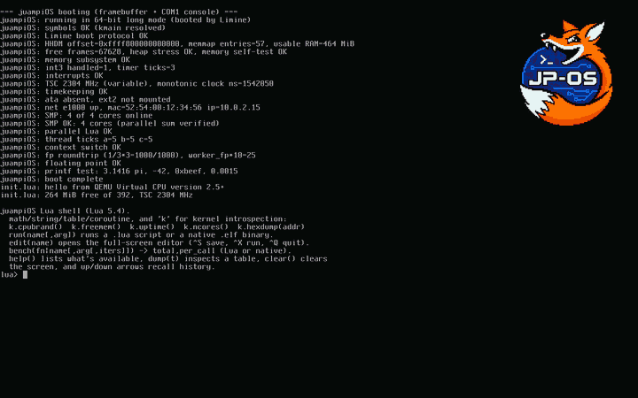

  

<h1 align="center">juampi-os</h1>

   
  <em>Cold boot → kernel self-tests (SMP, networking, parallel Lua) → the ring-0 Lua shell → <code>run("boing.lua")</code>, the Amiga Boing Ball on the framebuffer.</em>

My kernel — originally the final project for *Organización del Computador II*
(UBA - FCEyN), since ported to x86-64.

Features
--------

* **Core:** 64-bit (x86-64 long mode), booted by [Limine](https://github.com/limine-bootloader/limine);
  higher-half kernel with 4-level paging over Limine's direct map (HHDM).
* **Interrupts & time:** 64-bit IDT, PIC + PIT, TSC timekeeping, and serial
  fault dumps with symbolized stack backtraces.
* **SMP:** brings up all cores (Limine's MP request), per-CPU GDT/TSS, spinlocks,
  and spin-polled cross-core work dispatch.
* **Scheduling:** software context switching with cooperative kernel threads;
  SSE/x87 floating-point state saved across switches.
* **User mode:** ring 3 with an `int 0x80` syscall ABI and validated user
  pointers, and an ELF64 loader that runs real user programs.
* **Storage:** ATA PIO disk and a read/write **ext2** filesystem.
* **Graphics:** framebuffer console (flanterm) with runtime mode-setting, a
  drawing library, QOI image decoding, and a boot logo; PS/2 keyboard.
* **Networking:** an Intel **e1000** NIC driver and a small IPv4 stack —
  Ethernet/ARP/IPv4/ICMP plus **UDP** and **TCP** (client *and* server) — over
  QEMU user-mode networking.
* **Platform:** PCI enumeration, ACPI shutdown/reboot, hardware RNG (RDRAND).
* **Lua 5.4 in ring 0:** boots to a syntax-highlighted REPL with history and
  in-line editing, a full-screen text editor, and libraries — `k` (kernel
  introspection), `fb` (graphics), `fs`/`disk` (storage), `pci`, `net`,
  `thread`/`mem` (parallelism) — plus `run()` and `bench()`.
* **Parallel Lua:** one interpreter per core, each with its own heap, with
  `thread.spawn`/`join` and shared-memory buffers for genuine multicore Lua.

The x86-64 port is documented milestone by milestone in `docs/x86-64-port.md`;
`docs/lua-shell.md` and `docs/networking.md` cover the parallel Lua shell and
the network stack. The kernel now runs well past the original 32-bit project —
SMP, parallel Lua, a read/write filesystem, and a TCP/IP stack are all in place.

Building and running
--------------------

The repo ships a Nix/devenv environment (`devenv shell`, or automatic with
direnv) providing the whole toolchain: host GCC, QEMU, Limine, mtools and
clang-format. Then:

    make && make run

| Target            | Description                                            |
|-------------------|--------------------------------------------------------|
| `make`            | Build the kernel and the bootable UEFI image           |
| `make kernel.bin` | Build just the kernel binary                           |
| `make run`        | Boot the image in QEMU under OVMF (`QEMU_DISPLAY=...`) |
| `make test`       | Run the headless end-to-end test suite (as CI does)    |
| `make format`     | Reformat all C sources/headers with clang-format       |
| `make lint`       | Check formatting without modifying files (used by CI)  |
| `make clean`      | Remove all build artifacts                             |

The boot image is a plain FAT/UEFI image built entirely in userspace with
`mtools` — no `sudo`, no loopback mounts. Without Nix, install
`gcc qemu-system-x86 ovmf mtools clang-format` (plus `socat` and `e2fsprogs`
for `make test`), fetch Limine's binary branch, and point the build at them
(see `.github/workflows/ci.yml` for the exact recipe).

Testing
-------

`make test` boots the full image headless under OVMF and drives it through a
suite of end-to-end checks, each asserting on the serial log: the kernel reaches
the Lua shell and evaluates input, PS/2 keyboard input round-trips, a script
runs from the ext2 disk, a native ELF binary runs, the NIC comes up and pings
the gateway, UDP and TCP sockets round-trip datagrams/streams, and parallel Lua
runs across every core. CI runs the same suite.

Documentation
-------------

The `docs/` folder is an [Obsidian](https://obsidian.md) vault of design notes:

* `docs/x86-64-port.md` — the x86-64 port, milestone by milestone.
* `docs/lua-shell.md` — booting to the parallel, ring-0 Lua shell.
* `docs/networking.md` — the e1000 driver and the IPv4/UDP/TCP stack.
* `informe/` — the original project report (in Spanish); `make` inside that
  folder generates the PDF.

TODOs
------

* Interrupt-driven NIC receive (RX is polled today) and DHCP/DNS.
* Preemptive scheduling (kernel threads are cooperative).
* Processes and `fork`/copy-on-write on the 64-bit base.
* DMA disk I/O (the ATA driver is PIO) and more block/device drivers.
* Port a libc (musl) for a richer ring-3 userland.

License
-------

The kernel is licensed under the MIT License (see `LICENSE`). Bundled
third-party components keep their own permissive licenses: flanterm
(BSD-2-Clause, `src/flanterm/`), eyalroz/printf (MIT, `src/printf/`), Lua 5.4
(MIT, `src/lua/`), and the Limine boot protocol header (0BSD,
`include/limine.h`).

Acknowledgements
---------------

* See the acknowledgements in the report.
* OSDev Wiki: <http://osdev.org>
* James Molloy's kernel development tutorials: <http://jamesmolloy.co.uk/tutorial_html>
