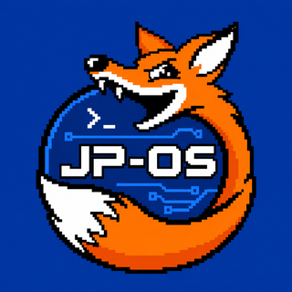
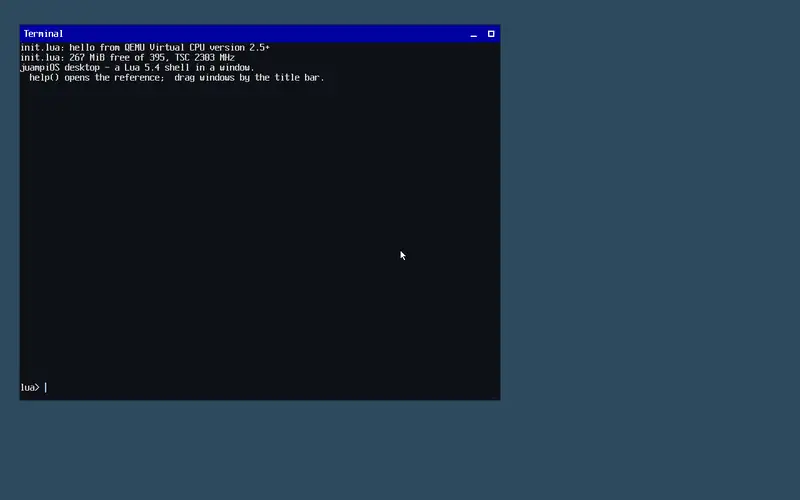

  

<h1 align="center">juampi-os</h1>

   
  <em>The windowed ring-0 desktop — the Lua shell enumerating the live USB device tree, maximize/minimize/resize window controls, the native multicore raytracer (<code>run("raytracer.elf")</code>), and the Amiga Boing Ball. &nbsp;<a href="assets/demo.mp4">▶&nbsp;full-quality&nbsp;MP4</a></em>

<!--
  The inline preview is an animated WebP (assets/demo.webp) — GitHub renders it
  like a GIF but at 24-bit colour and a fraction of the size. For a real inline
  video player instead, drag assets/demo.mp4 into the README editor or a PR
  comment on GitHub; that yields a https://github.com/.../assets/... URL you can
  drop into a <video> tag, e.g.:
    <video src="https://github.com/USER/juampi-os/assets/ID/UUID.mp4"
           autoplay loop muted playsinline width="760"></video>
  A committed relative path (assets/demo.mp4) renders as a link, not a player.
-->

My kernel — originally the final project for *Organización del Computador II*
(UBA - FCEyN), since ported to x86-64.

Features
--------

* **Core:** 64-bit (x86-64 long mode), booted by [Limine](https://github.com/limine-bootloader/limine);
  higher-half kernel with 4-level paging over Limine's direct map (HHDM).
* **Interrupts & time:** the modern **APIC** stack — Local APIC timer (the
  tick), I/O APIC device routing, and **MSI-X** for NVMe and xHCI — everything
  discovered from ACPI/CPUID, with the legacy 8259 PIC/PIT fully retired.
  PIT-free TSC timekeeping (CPUID or the ACPI PM timer), serial fault dumps
  with symbolized stack backtraces.
* **SMP:** brings up all cores (Limine's MP request), per-CPU GDT/TSS, spinlocks,
  and spin-polled cross-core work dispatch.
* **Scheduling:** software context switching with cooperative kernel threads;
  SSE/x87 floating-point state saved across switches.
* **User mode:** ring 3 with an `int 0x80` syscall ABI and validated user
  pointers, and an ELF64 loader that runs real user programs.
* **Storage:** **NVMe** (zero-copy PRP transfers, MSI-X completions), **USB
  mass storage** (SCSI over Bulk-Only Transport), and ATA PIO — all behind one
  block-device interface, with a read/write **ext2** filesystem that mounts
  from whichever is present.
* **USB:** an **xHCI** driver that enumerates every port — recursing through
  **hubs** — with **HID keyboard and mouse** support, so input needs no legacy
  i8042 (PS/2 still works when present).
* **Graphics & UI:** framebuffer console (flanterm) with runtime mode-setting,
  a drawing library, QOI image decoding — and a windowed **desktop** (microui):
  the REPL in a draggable terminal, a vim-style editor window, a file browser,
  and graphics demos in windows.
* **Audio:** a device-independent software mixer (48 kHz stereo) over a
  pluggable backend — **Intel HD Audio** (MMIO, CORB/RIRB codec verbs, stream
  DMA) and **AC'97**, probed in order — with **QOA** audio decoding, sine-tone
  synthesis, and interrupt-driven playback whose completion IRQ is routed
  through the ACPI `_PRT`. Driven from Lua as `audio.*`.
* **Networking:** an Intel **e1000** NIC driver and a small IPv4 stack —
  Ethernet/ARP/IPv4/ICMP, **UDP** and **TCP** (client *and* server), **DHCP**,
  **DNS**, and an **HTTP/HTTPS** client (TLS 1.2 via BearSSL with a curated
  root set) — over QEMU user-mode networking.
* **Platform:** PCI enumeration; full **ACPI** via the vendored **uACPI** (AML
  interpreter + namespace) — soft-off/reboot through `_S5`, a working power
  button, and PCI interrupt routing (`_PRT`); hardware RNG (RDRAND).
* **Lua 5.4 in ring 0:** boots to a syntax-highlighted REPL with history and
  in-line editing, typed self-documenting libraries (`help()` shows real
  signatures) — `k` (kernel introspection), `fb` (graphics), `audio` (mixer,
  tones, QOA playback), `fs`/`disk` (filesystem + raw NVMe/USB/ATA blocks),
  `pci`, `usb`, `net`/`http`, `thread`/`mem` (parallelism), `ui` (windows) —
  plus `run()` and `bench()`.
* **Parallel Lua:** one interpreter per core, each with its own heap, with
  `thread.spawn`/`join` and shared-memory buffers for genuine multicore Lua.

The x86-64 port is documented milestone by milestone in `docs/x86-64-port.md`;
`docs/lua-shell.md` and `docs/networking.md` cover the parallel Lua shell and
the network stack. The kernel now runs well past the original 32-bit project —
SMP, parallel Lua, a read/write filesystem on modern storage, a TCP/IP stack
with HTTPS, a full-AML ACPI layer, an HD-Audio mixer, and a fully legacy-free
interrupt and input path are all in place.

Building and running
--------------------

The repo ships a Nix/devenv environment (`devenv shell`, or automatic with
direnv) providing the whole toolchain: host GCC, QEMU, Limine, mtools and
clang-format. Then:

    make && make run

| Target            | Description                                            |
|-------------------|--------------------------------------------------------|
| `make`            | Build the kernel and the bootable UEFI image           |
| `make kernel.bin` | Build just the kernel binary                           |
| `make run`        | Boot the image in QEMU under OVMF (`QEMU_DISPLAY=...`) |
| `make test`       | Run the headless end-to-end test suite (as CI does)    |
| `make format`     | Reformat all C sources/headers with clang-format       |
| `make lint`       | Check formatting without modifying files (used by CI)  |
| `make clean`      | Remove all build artifacts                             |

The boot image is a plain FAT/UEFI image built entirely in userspace with
`mtools` — no `sudo`, no loopback mounts. Without Nix, install
`gcc qemu-system-x86 ovmf mtools clang-format` (plus `socat` and `e2fsprogs`
for `make test`), fetch Limine's binary branch, and point the build at them
(see `.github/workflows/ci.yml` for the exact recipe).

Testing
-------

`make test` boots the full image headless under OVMF and drives it through a
suite of end-to-end checks, each asserting on the serial log: the kernel reaches
the Lua shell and evaluates input, PS/2 keyboard input round-trips, a script
runs from the ext2 disk, a native ELF binary runs, the NIC comes up and pings
the gateway, UDP and TCP sockets round-trip datagrams/streams, both audio
backends (AC'97 and Intel HD Audio) route their completion interrupt through the
ACPI `_PRT` and take interrupts while a tone plays, and parallel Lua runs across
every core. CI runs the same suite.

Documentation
-------------

The `docs/` folder is an [Obsidian](https://obsidian.md) vault of design notes:

* `docs/x86-64-port.md` — the x86-64 port, milestone by milestone.
* `docs/lua-shell.md` — booting to the parallel, ring-0 Lua shell.
* `docs/networking.md` — the e1000 driver and the IPv4/UDP/TCP stack.
* `docs/acpi-uacpi.md` — the uACPI integration: full AML, `_S5` shutdown, the
  power button, and `_PRT` PCI interrupt routing.
* `docs/hda-audio.md` — the Intel HD Audio backend behind the mixer vtable.
* `informe/` — the original project report (in Spanish); `make` inside that
  folder generates the PDF.

TODOs
------

* Boot on real hardware (a Dell XPS 15) — the NVMe, xHCI, APIC, uACPI and
  HD-Audio work all point here (HDA is verified in QEMU; the XPS headphone-jack
  path over the codec's HDA link is the next real-hardware target).
* Preemptive scheduling (kernel threads are cooperative) and LAPIC IPIs.
* Processes and `fork`/copy-on-write on the 64-bit base.
* Interrupt-driven NIC receive (RX is polled today).
* USB polish: host-side key repeat, transaction translators (low/full-speed
  devices behind high-speed hubs).
* Port a libc (musl) for a richer ring-3 userland.

License
-------

The kernel is licensed under the MIT License (see `LICENSE`). Bundled
third-party components keep their own permissive licenses: flanterm
(BSD-2-Clause, `src/flanterm/`), eyalroz/printf (MIT, `src/printf/`), Lua 5.4
(MIT, `src/lua/`), microui (MIT, `src/microui/`), BearSSL (MIT,
`src/bearssl/`), picohttpparser (MIT, `src/http/`), and the Limine boot
protocol header (0BSD, `include/limine.h`).

Acknowledgements
---------------

* See the acknowledgements in the report.
* OSDev Wiki: <http://osdev.org>
* James Molloy's kernel development tutorials: <http://jamesmolloy.co.uk/tutorial_html>
